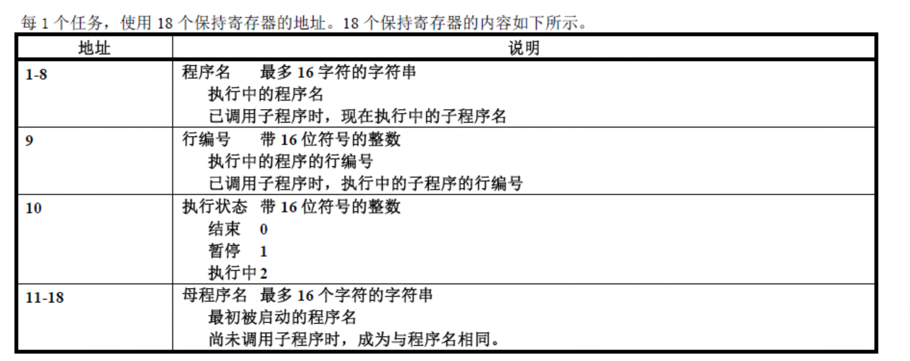
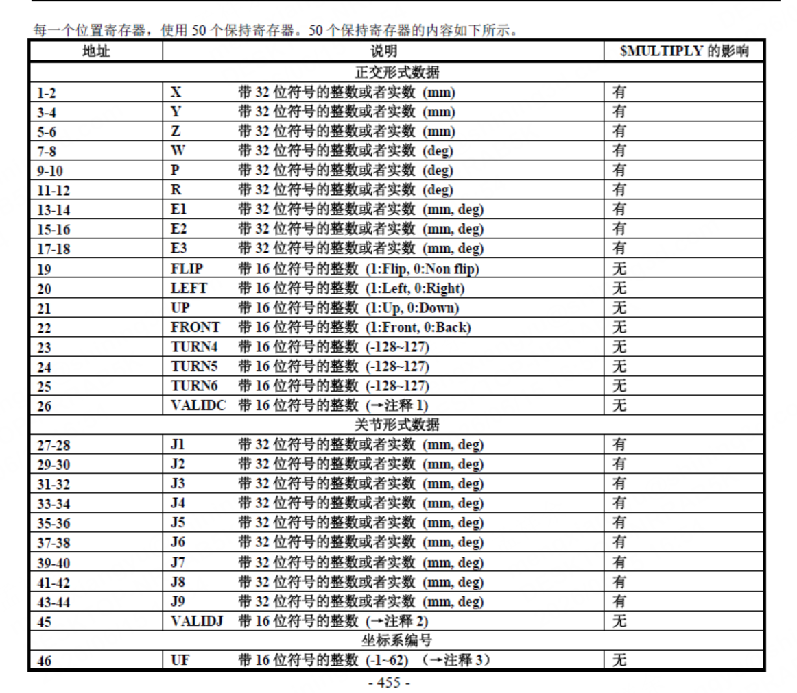

1-50   实际位置   POS[0]

101-150  目标位置  PR[1]

201-218  程序状态

- 读取1-50个寄存器，机器人当前坐标系坐标值和关节角度都在里面
- 201-218  18个寄存器是程序的状态
- 机器人IP地址:192.168.1.10 

---

## 位置寄存器结构（image-1.png 解析）

每一个位置寄存器（POS[0] / PR[1]）使用 **50 个保持寄存器**，偏移地址从 1 开始。

### 正交形式数据（直角坐标）

| 偏移地址 | 字段 | 类型 | 单位 |
|---|---|---|---|
| 1-2 | X | 带32位符号的整数或实数 | mm |
| 3-4 | Y | 带32位符号的整数或实数 | mm |
| 5-6 | Z | 带32位符号的整数或实数 | mm |
| 7-8 | W | 带32位符号的整数或实数 | deg |
| 9-10 | P | 带32位符号的整数或实数 | deg |
| 11-12 | R | 带32位符号的整数或实数 | deg |
| 13-14 | E1 | 带32位符号的整数或实数 | mm/deg |
| 15-16 | E2 | 带32位符号的整数或实数 | mm/deg |
| 17-18 | E3 | 带32位符号的整数或实数 | mm/deg |
| 19 | FLIP | 带16位符号的整数 | 1:Flip, 0:Non flip |
| 20 | LEFT | 带16位符号的整数 | 1:Left, 0:Right |
| 21 | UP | 带16位符号的整数 | 1:Up, 0:Down |
| 22 | FRONT | 带16位符号的整数 | 1:Front, 0:Back |
| 23 | TURN4 | 带16位符号的整数 | -128~127 |
| 24 | TURN5 | 带16位符号的整数 | -128~127 |
| 25 | TURN6 | 带16位符号的整数 | -128~127 |
| 26 | VALIDC | 带16位符号的整数 | 坐标有效标志 |

### 关节形式数据

| 偏移地址 | 字段 | 类型 | 单位 |
|---|---|---|---|
| 27-28 | J1 | 带32位符号的整数或实数 | mm/deg |
| 29-30 | J2 | 带32位符号的整数或实数 | mm/deg |
| 31-32 | J3 | 带32位符号的整数或实数 | mm/deg |
| 33-34 | J4 | 带32位符号的整数或实数 | mm/deg |
| 35-36 | J5 | 带32位符号的整数或实数 | mm/deg |
| 37-38 | J6 | 带32位符号的整数或实数 | mm/deg |
| 39-40 | J7 | 带32位符号的整数或实数 | mm/deg |
| 41-42 | J8 | 带32位符号的整数或实数 | mm/deg |
| 43-44 | J9 | 带32位符号的整数或实数 | mm/deg |
| 45 | VALIDJ | 带16位符号的整数 | 关节角有效标志 |
| 46 | UF | 带16位符号的整数 | 用户坐标系编号（-1~62） |

> **读取示例**（POS[0] 起始寄存器为 1，ADR=0）：
> - 直角坐标 X/Y/Z/W/P/R → ADR=0, LEN=12
> - 关节角度 J1-J6 → ADR=26, LEN=12

---

## 程序状态寄存器结构（image.png 解析）

每 1 个任务使用 **18 个保持寄存器**，偏移地址从 1 开始。

| 偏移地址 | 字段 | 类型 | 说明 |
|---|---|---|---|
| 1-8 | 程序名 | 字符串（最多16字符） | 执行中的程序名；已调用子程序时为当前执行中的子程序名 |
| 9 | 行编号 | 带16位符号的整数 | 执行中程序的当前行编号 |
| 10 | 执行状态 | 带16位符号的整数 | **0 = 结束，1 = 暂停，2 = 执行中** |
| 11-18 | 母程序名 | 字符串（最多16字符） | 最初被启动的程序名；未调用子程序时与程序名相同 |

> **判断机器人是否在移动**（程序状态起始寄存器为 201，ADR=200）：
> - 读取 ADR=200, LEN=18，取第 10 个值（对应寄存器 210，偏移量 9）
> - 值 **== 2** → TP 程序执行中 → 机器人正在运动
> - 值 **== 1** → 暂停（机器人静止）
> - 值 **== 0** → 程序结束（机器人静止）
